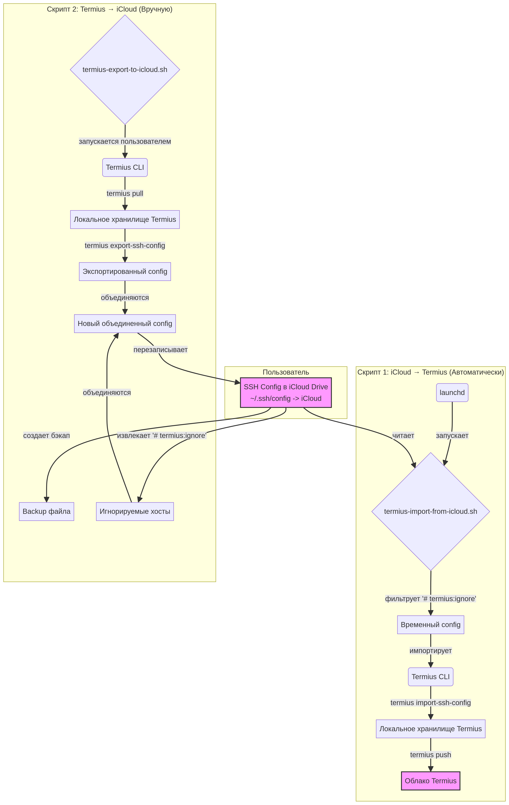

# Termius ↔ iCloud SSH Config Sync

 

**Версия:** 1.1.0
**Автор:** Manus AI

Утилита для двунаправленной синхронизации вашего SSH-конфига между iCloud Drive и Termius на macOS. Храните единый файл `~/.ssh/config` в iCloud, используйте его во всех стандартных терминалах и автоматически синхронизируйте с Termius, исключая при этом хосты, которые вы хотите оставить локальными.

## Зачем это нужно?

Многие разработчики используют как стандартные терминалы (Terminal, iTerm2), так и продвинутые клиенты вроде Termius. Это создает проблему синхронизации:

-   **Стандартные терминалы** читают конфигурацию из `~/.ssh/config`.
-   **Termius** имеет собственное облачное хранилище, которое синхронизируется между вашими устройствами.

Вручную поддерживать оба конфига в актуальном состоянии неудобно и приводит к ошибкам. Эта система решает проблему, делая ваш **файл в iCloud Drive центральным источником правды**, который автоматически синхронизируется с Termius.

## Основные возможности

-   **Централизованный SSH-конфиг:** Храните один файл `~/.ssh/config` в iCloud Drive, доступный на всех ваших Mac.
-   **Автоматический импорт в Termius:** Скрипт, работающий через `launchd`, автоматически отслеживает изменения в вашем iCloud-конфиге и импортирует их в Termius.
-   **Ручной экспорт из Termius:** Скрипт для экспорта конфигурации из Termius обратно в iCloud, когда вы вносите изменения непосредственно в приложении.
-   **Игнорирование хостов:** Возможность пометить хосты специальным комментарием `# termius:ignore`, чтобы они не импортировались в Termius. Это полезно для секретных или временных хостов.
-   **Резервное копирование:** Автоматическое создание бэкапов вашего iCloud-конфига перед его перезаписью при экспорте из Termius.
-   **Простая установка:** Интерактивный установочный скрипт, который настраивает всю систему за вас.

## Архитектура

Система состоит из двух основных скриптов, работающих в связке с Termius CLI и `launchd`.



## Как это работает

### Сценарий 1: Изменение конфига в iCloud (Автоматически)

1.  Вы редактируете файл `~/.ssh/config`, который является симлинком на файл в iCloud Drive.
2.  `launchd` замечает изменение файла и запускает скрипт `termius-import-from-icloud.sh`.
3.  Скрипт читает ваш конфиг и **пропускает** все хосты, помеченные `# termius:ignore`.
4.  Отфильтрованный конфиг импортируется в Termius (`termius import-ssh-config`).
5.  Изменения отправляются в облако Termius (`termius push`).

### Сценарий 2: Изменение конфига в Termius (Вручную)

1.  Вы добавляете новый хост или меняете существующий прямо в приложении Termius.
2.  Вы запускаете в терминале команду `termius-export-to-icloud.sh`.
3.  Скрипт получает актуальные данные из Termius (`termius pull` и `termius export-ssh-config`).
4.  Создается бэкап вашего текущего файла в iCloud.
5.  Скрипт находит все хосты с пометкой `# termius:ignore` в вашем старом файле и **сохраняет** их.
6.  Создается новый файл `config`, объединяя хосты из Termius и ваши сохраненные локальные хосты.
7.  Новый файл заменяет старый в iCloud Drive.

## Установка

1.  **Клонируйте репозиторий** или скачайте архив с файлами.

2.  **Перейдите в директорию** проекта в терминале:
    ```bash
    cd path/to/termius-sync
    ```

3.  **Запустите скрипт установки**:
    ```bash
    ./install.sh
    ```

Скрипт установки проведет вас через все шаги: проверит зависимости, поможет настроить директорию в iCloud, создаст симлинк и установит `LaunchAgent`.

## Использование

### Игнорирование хостов

Чтобы предотвратить импорт определенного хоста в Termius, добавьте комментарий `# termius:ignore` внутри блока этого хоста. Рекомендуется добавлять его сразу после строки `Host`.

**Пример:**

```ssh-config
# Этот хост будет импортирован
Host prod-server
    HostName 1.2.3.4
    User admin

# Этот хост будет проигнорирован
Host secret-dev-machine
    # termius:ignore
    HostName 192.168.1.100
    User developer
```

### Ручные команды

-   **Импорт из iCloud в Termius:** `termius-import-from-icloud.sh`
-   **Экспорт из Termius в iCloud:** `termius-export-to-icloud.sh`

## Конфигурация

Вы можете переопределить пути по умолчанию с помощью переменных окружения при запуске скриптов или в `com.user.termius-import.plist`.

| Переменная | Описание | По умолчанию |
| :--- | :--- | :--- |
| `ICLOUD_SSH_CONFIG` | Путь к файлу `config` в iCloud Drive. | `~/Library/Mobile Documents/com~apple~CloudDocs/SSH/config` |
| `LOCAL_SSH_CONFIG` | Путь к локальному файлу `config`. | `~/.ssh/config` |
| `BACKUP_DIR` | Директория для хранения бэкапов. | `~/.local/backup/ssh-config` |
| `LOG_DIR` | Директория для лог-файлов. | `~/.local/log/termius-sync` |
| `MAX_BACKUPS` | Максимальное количество бэкапов для хранения. | `30` |

## Удаление

Для полного удаления системы запустите скрипт установки с флагом `--uninstall`:

```bash
./install.sh --uninstall
```

## Зависимости

-   **macOS** 12.0+ (Monterey) или новее.
-   **Termius** и **Termius CLI** (`brew install termius`).
-   **iCloud Drive** (должен быть включен и настроен).
